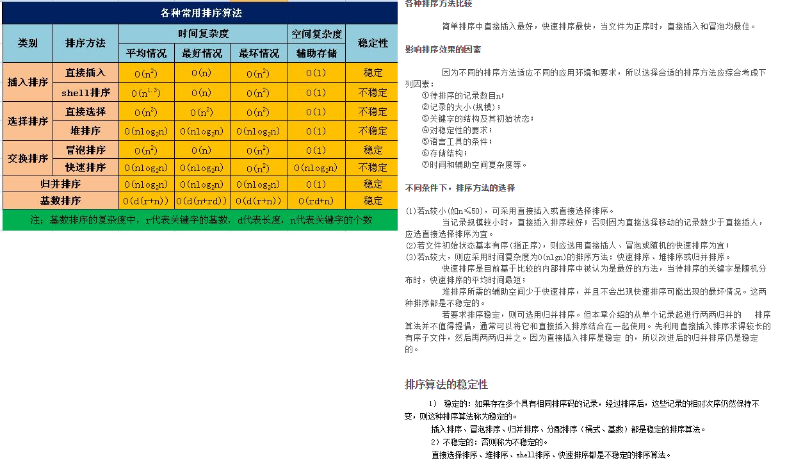

# 快速排序
http://blog.csdn.net/morewindows/article/details/6684558
该方法的基本思想是：
1．先从数列中取出一个数作为基准数。
2．分区过程，将比这个数大的数全放到它的右边，小于或等于它的数全放到它的左边。
3．再对左右区间重复第二步，直到各区间只有一个数。
虽然快速排序称为分治法，但分治法这三个字显然无法很好的概括快速排序的全部步骤。因此我的对快速排序作了进一步的说明：挖坑填数+分治法
```
   int i = l, j = r;  
    int x = s[l]; //s[l]即s[i]就是第一个坑  
    while (i < j)  
    {  
        // 从右向左找小于x的数来填s[i]  
        while(i < j && s[j] >= x)   
            j--;    
        if(i < j)   
        {  
            s[i] = s[j]; //将s[j]填到s[i]中，s[j]就形成了一个新的坑  
            i++;  
        }  
  
        // 从左向右找大于或等于x的数来填s[j]  
        while(i < j && s[i] < x)  
            i++;    
        if(i < j)   
        {  
            s[j] = s[i]; //将s[i]填到s[j]中，s[i]就形成了一个新的坑  
            j--;  
        }  
    }  
    //退出时，i等于j。将x填到这个坑中。  
    s[i] = x;  
  
    return i; 
```
# 归并排序
http://blog.csdn.net/morewindows/article/details/6678165/
# shell排序
http://blog.csdn.net/jianyuerensheng/article/details/51258460
代码和直接插入代码比对
```
直接插入

	int j;
	for(j=1;j<a.length;j++){
                        int temp=a[j];
			int i;
			for(i=j-1;i>=0;i--){
				if(a[i]>temp){
					a[i+1]=a[i];
				}
				else{
					break;
				}
			}
			a[i+1]=temp;
		}

shell排序
          for (int i = increment; i < data.length; i++) {
                temp = data[i];
                for (j = i - increment; j >= 0; j -= increment) {
                    if (temp < data[j]) {
                        data[j + increment] = data[j];
                    } else {
                        break;
                    }
                }
                data[j + increment] = temp;


```


