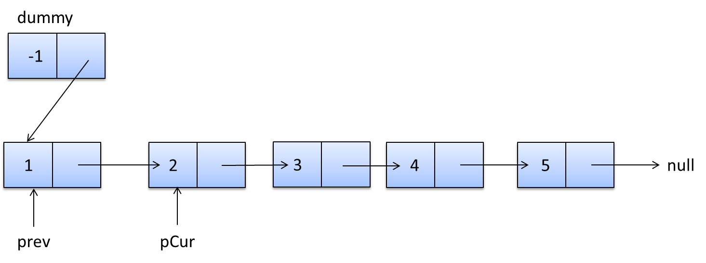
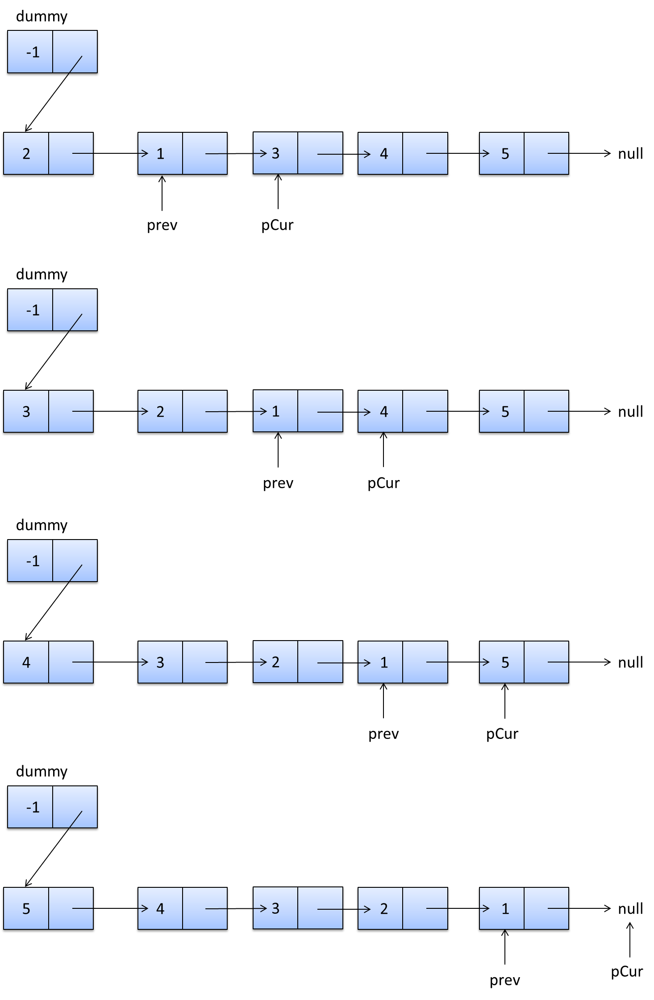

浪费了我一下午时间的单链表反转，忍不了。。。
# 原地反转
把当前链表的下一个节点pCur插入到头结点dummy的下一个节点中，就地反转。

dummy->1->2->3->4->5的就地反转过程：
```
dummy->2->1->3->4->5
dummy->3->2->1->4->5
dummy->4>-3->2->1->5
dummy->5->4->3->2->1
```
pCur是需要反转的节点。
prev连接下一次需要反转的节点
反转节点pCur
纠正头结点dummy的指向
pCur指向下一次要反转的节点
```
1 prev.next = pCur.next;
2 pCur.next = dummy.next;
3 dummy.next = pCur;
4 pCur = prev.next;
```


# 新建链表，遍历旧链表，将旧链表的每个节点分别插入头结点后面
```
public ListNode reverseList2(ListNode head) {
         ListNode dummy = new ListNode(-1);
         ListNode pCur = head;
         while (pCur != null) {
             ListNode pNex = pCur.next;
             pCur.next = dummy.next;
             dummy.next = pCur;
             pCur = pNex;
         }
         return dummy.next;
     }
```
